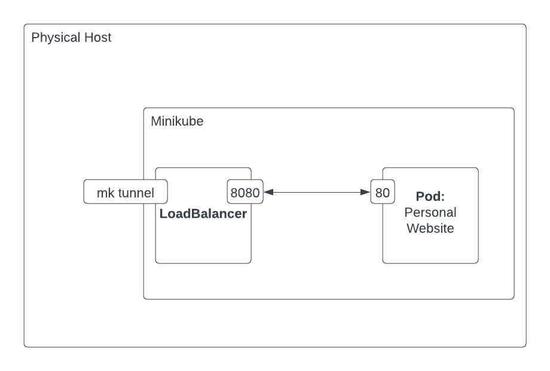

# Homelab


# Usage

## Install K8s and Minikube
```bash
./install_k8s_mac.sh
```

## Start Minikube
```bash
./minikube_start.sh
```

## Start Services
```
./apply.sh
```

## Run website
```
./minikube_display_personal_website.sh
```
